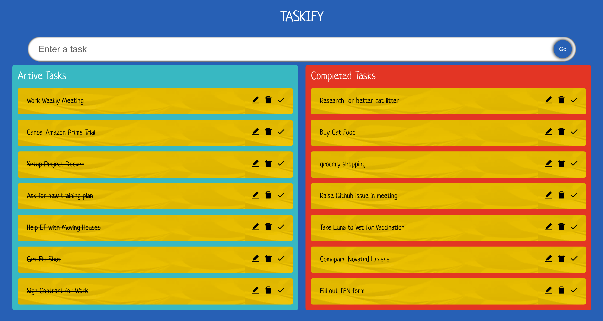

## Taskify - a TypeScript To Do App

Demo at <a href="https://taskify-two.vercel.app/"> Here </a>

### Tech Stack: 
- React
- TypeScript
- react-beautiful-dnd
- React-icons 
- deployed on Vercel

### Instruction: How to install and run

- npm install (to install dependencies)
- npm start (to run the project on local host)

#### Current main features:

- Users can create tasks 
- Users can edit/remove or mark tasks as done (show as striked text)
- Users can drag and drop tasks to completed section or vice versa

### Application ScreenShot

